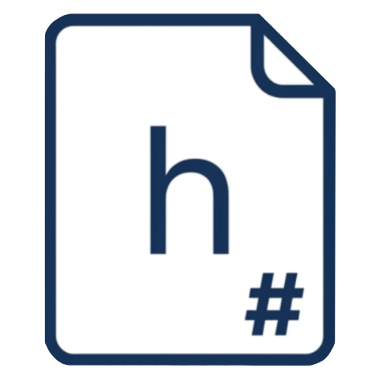

<p align="center">
  
</p>

<h1 align="center">HumbleResume</h1>

<p align="center">A simple desktop app for writing resumes in Markdown and exporting them as PDFs.</p>

> [!NOTE]
> **This project is in early development.** Expect rough edges.

## Features

- Markdown editor with live preview
- All your files are saved locally; the app only ever uses the internet to optionally retrieve Iconify icons
- PDF export to A4 or Letter page size
- Multiple basic templates — Modern, Minimal, Academic
- Custom CSS you can use to edit template styles per resume
- Light/dark theme

## Getting Started

```bash
pnpm install
pnpm tauri dev
```

To build a release binary:

```bash
pnpm tauri build
```
## Notes

PDF export is handled by the OS's print dialog. You probably have to tinker around with it to get the proper output such as using A4/Letter Borderless. <br />
macOS in particular can be pretty finnicky with its printing options, so you may have to re-export with Preview.
